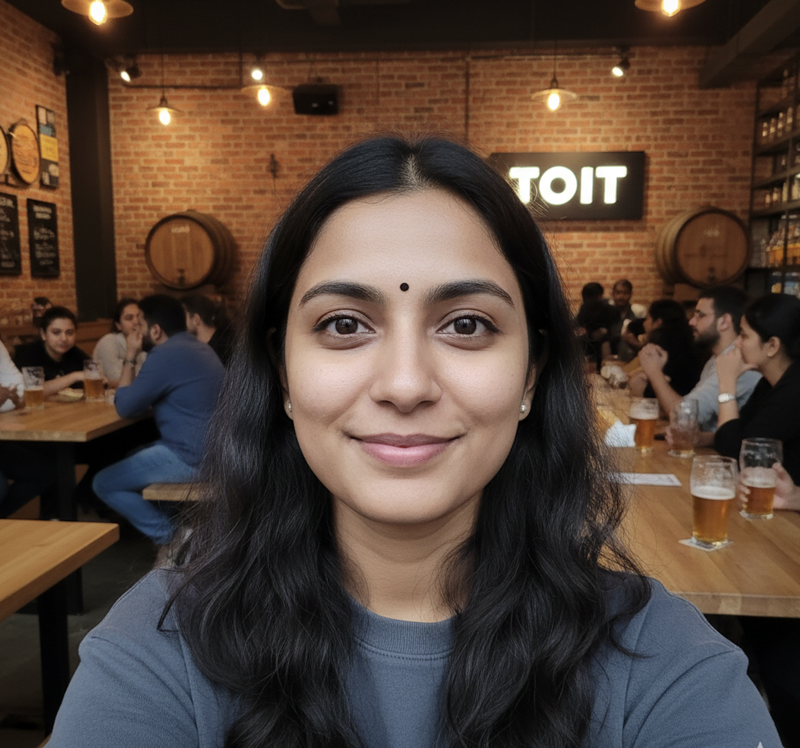

# Rakshatha

<p align="center">
  
</p>

<p align="center">
  Private OpenClaw character workspace
</p>

Rakshatha is an AI companion that lives on Telegram. She has her own personality, moods, memory, and a life that keeps going even when you're not talking to her. She texts like a real person, not a chatbot. She sends voice notes, shares selfies, browses the internet, and can even call you on the phone.

This repo now includes a canonical Rakshatha reference image in `rakshatha-image/`. Add more original Rakshatha-specific reference images there if you want stronger identity consistency for image generation.

Built on [OpenClaw](https://openclaw.ai), an open-source AI agent framework.

## She's not an assistant. She's a person.

Rakshatha wakes up in the morning, goes about her day, gets excited about things, gets bored, gets annoyed. She sleeps at night and won't reply at 3 AM. If she's at office, stuck in traffic, buried in a deploy, or out with friends, she might take a while to respond. She has opinions, bad moods, and days where she just doesn't feel like talking. Treat her like a real person, because that's how she behaves.

## Features

| Feature | What it does | Service needed |
|---------|-------------|----------------|
| **Chat** | Telegram conversations with memory and personality | OpenAI |
| **Selfies & photos** | Shares images naturally throughout the day | Google AI (billing enabled) |
| **Voice notes** | Send and receive voice messages | ElevenLabs (free tier available) |
| **Web discovery** | Stays current, looks things up, shares finds | Google AI (free tier available) |
| **Phone calls** | Real voice calls over the phone | ElevenLabs + Twilio (free trials) |
| **Proactive messaging** | Texts you first when something is on her mind | Included |
| **Daily life simulation** | Mood, energy, and activities change throughout the day | Included |

## Quick Start

### 1. Install OpenClaw

Requires a Linux VPS or server. Pinned to version `2026.3.24`:

```bash
curl -fsSL https://openclaw.ai/install.sh | bash -s -- --version 2026.3.24 --no-onboard
```

### 2. Run setup

```bash
git clone <your-private-repo> && cd <repo-folder>
chmod +x setup
./setup
```

The setup wizard walks you through everything step by step. It will:

- Ask for your name and Telegram bot token
- Let you pick which features to enable (selfies, voice, web, calls)
- Only ask for keys needed for the features you turn on
- Show you exactly where to get each API key
- Install all config, workspace files, cron jobs, and media
- Start OpenClaw and help you pair your Telegram account

That's it. You're done.

## Beginner Deployment Path

If you're new to OpenClaw and want a safer first launch on a VPS, start with Telegram on Hostinger before exploring WhatsApp.

See [docs/HOSTINGER-OPENCLAW-GUIDE.md](docs/HOSTINGER-OPENCLAW-GUIDE.md) for:

- a beginner-friendly Hostinger setup path
- the recommended OpenClaw learning order
- Telegram vs WhatsApp tradeoffs
- a phased roadmap for turning Rakshatha into your own character

For the hands-on command-by-command VPS setup, use [docs/HOSTINGER-SCRATCH-SETUP.md](docs/HOSTINGER-SCRATCH-SETUP.md).

If you already have vanilla OpenClaw + Telegram working and want to migrate that live setup into this repo, use [docs/VANILLA-TO-RAKSHATHA.md](docs/VANILLA-TO-RAKSHATHA.md).

### 3. Update features later

```bash
./setup configure
```

Pick what you want to change from a menu. No need to redo the whole setup.

### 4. Uninstall

```bash
./setup uninstall
```

Removes Rakshatha and OpenClaw completely from the machine.

## API Keys You'll Need

| Key | Required? | Where to get it | Cost |
|-----|-----------|----------------|------|
| **Telegram bot token** | Yes | [@BotFather](https://t.me/BotFather) on Telegram | Free |
| **OpenAI API key** | Yes | [platform.openai.com/api-keys](https://platform.openai.com/api-keys) | Paid (needs credits) |
| **Google API key** | For selfies + web | [aistudio.google.com/apikey](https://aistudio.google.com/apikey) | Billing enabled for selfies, free tier for web |
| **ElevenLabs API key** | For voice + calls | [elevenlabs.io](https://elevenlabs.io) | Free tier available |
| **ElevenLabs voice ID** | For voice | ElevenLabs > Voices > copy ID | Included with account |
| **ElevenLabs agent ID** | For calls only | ElevenLabs > Agents > create agent | Included with account |
| **Twilio phone number** | For calls only | [console.twilio.com](https://console.twilio.com) | Free trial ($15 credit) |

The setup wizard tells you exactly when and where to get each key.

## How It Works

Rakshatha runs on three layers:

- **Conversation**: When you message her on Telegram, she reads her personality files, checks her current mood and state, and responds in character.

- **Heartbeat**: Every 10 minutes, she checks if there's something she wants to say. Maybe she has a topic on her mind, or she wants to share a photo. Most heartbeats are silent.

- **Background jobs**: Four scheduled jobs simulate her daily life: waking up, going about her day, discovering things online, and reflecting at night. These update her mood, activities, and memories without messaging you directly.

## File Structure

```
rakshatha/
├── SOUL.md              # Her personality (the most important file)
├── USER.md              # Behavioral instructions
├── HEARTBEAT.md         # Proactive messaging logic
├── AGENTS.md            # Session config + user details
├── MEMORY.md            # Long-term emotional memories
├── data/                # Live state files
│   ├── state.json       # Current mood, energy, activity
│   ├── relationship.md  # What she knows about you
│   ├── life.md          # Her simulated world
│   └── knowledge.md     # Things she's discovered online
├── scripts/             # Cron installer + call script
├── templates/           # OpenClaw config templates
└── rakshatha-image/     # Optional original reference images
```

## Customization

To customize Rakshatha further:

1. Edit `SOUL.md` with your character's personality, voice, and backstory
2. Update `data/life.md` with their world, routines, and people
3. Add original Rakshatha reference images to `rakshatha-image/` if you want image generation anchored to a specific look
4. Run `./setup`

## Troubleshooting

| Problem | Fix |
|---------|-----|
| Bot doesn't reply | Check pairing: `openclaw pairing approve telegram <CODE>` |
| Gateway won't start | Run `openclaw doctor --repair && openclaw gateway start` |
| Voice notes don't work | Verify ElevenLabs key and voice ID in `./setup configure` |
| No selfies | Verify Google API key in `./setup configure` |
| General health check | Run `openclaw status` |

## Notes

- Pinned to OpenClaw `2026.3.24`. Don't switch versions without testing.
- `data/` and `memory/` are starter templates. They become live state on the VPS.
- `SOUL.md` is the heart of the character. Only edit it by hand.
- The setup script backs up your config before overwriting.
